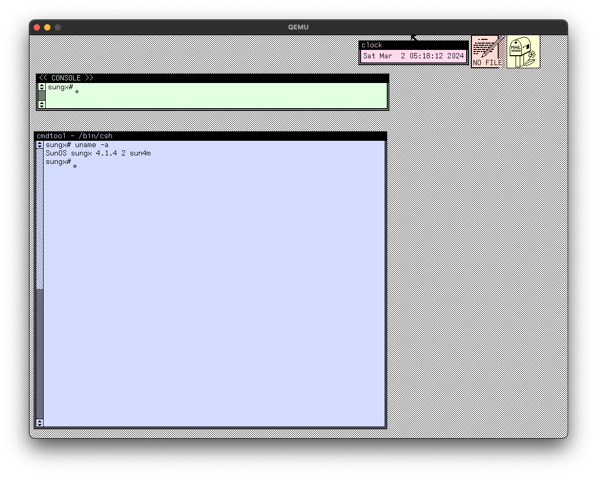

<h1 align="center">SunQ</h1>
<h3 align="center">a QEMU 8.X.X Template for running SunOS/Solaris on SPARC systems.</h3>
<h3 align="center">Linux / macOS Hosts on x86_64 / ARM64</h3>

<h2 align="center">Current Support Table</h2>

| Release | Status | Machine | Scripts | Install Disk | Guides |
| --- | --- | --- | --- | --- | --- |
| SunOS 1.0 | [X] | [?] | [?] | [?] | [?] |
| SunOS 1.1 | [X] | [?] | [?] | [?] | [?] |
| SunOS 1.2 | [X] | [?] | [?] | [?] | [?] |
| SunOS 2.0 | [X] | [?] | [?] | [?] | [?] |
| SunOS 3.0 | [X] | [?] | [?] | [?] | [?] |
| SunOS 3.2 | [X] | [?] | [?] | [?] | [?] |
| SunOS 3.5 | [X] | [?] | [?] | [?] | [?] |
| SunOS 4.x | [✓] | SPARCstation 5 | ``4.1.4`` | [Download](https://archive.org/details/solaris112sparc) | [4.1.4 Install Guide](guides/4.1.4-README.md) |
| SunOS 5.x | [X] | [?] | [?] | [?] | [?] |

###### Table Key: ``?`` means the information is still wip!, ``x`` means subversions are included, but may be different machine type when in use. ``Download`` takes you to the latest copy of the Release version, and ``Guides`` for specific installs.

<h2 align="center">Create Hard Disk for OS installation</h2>

Create a virtual HDD image where SunOS will be installed to. From the root of SunQ repo, issue the following command to get a prompt that asks for name, size and format of your HDD.

Example Usage:
```bash
royalgraphx@hypervisor SunQ % ./utilities/hdspawn.sh

HDSpawn (SunQ Edition)
Bash Version 1.0

Disk format (default: raw, qcow2): raw
Name of the disk image to create: os414
Size of the disk image (with suffixes k, M, G, T, P, E): 8G

Creating disk image...
Formatting 'harddrives/os414.img', fmt=raw size=8589934592
```

###### Create this image file on a fast SSD/NVMe disk for best results.

<h2 align="center">Repo Folder Structure</h2>

```bash
.
├── cdrom
│   └── .placeholder
├── floppy
│   └── .placeholder
├── harddrives
│   └── .placeholder
├── installers
│   └── .placeholder
├── roms
│   ├── romfile.bin
│   └── another_romfile.bin
├── SunOS-X.X.X-Boot.sh
├── SunOS-X.X.X-Install.sh
└── SunOS-X.X.X-PostInstall.sh
```

Directory meanings:

``CD-ROM`` - Folder to hold any images you typically swap in to the CD-ROM drive. </br>
``Floppy`` - Folder to hold any .fd images you use in the floppy drive. </br>
``Harddrives`` - Folder to hold multiple HDD images for multi-install target users. </br>
``Installers`` - Folder to hold SunOS install disks for easy sorting. </br>
``roms`` - Submodule Folder that holds various SPARC ROMs.

QEMU Launch files:

``-Boot.sh`` - For fully installed systems. </br>
``-Install.sh`` - For initial setup of an OS install. </br>
``-PostInstall.sh`` - Purposely drops the user into a shell, to boot to MINIROOT. </br>

<h2 align="center">Gallery</h2>

<h3 align="center">SunOS 4.1.4 on SPARCstation 5</h3>
<p align="center">
  
  <h5 align="center">Booting with ROM still broken on 8.2.1</h5>
  
  <h5 align="center">OpenBIOS works great, 256MB RAM</h5>
  
  <h5 align="center">SunView</h5>
  
  <h5 align="center">OpenWindows</h5>
</p>